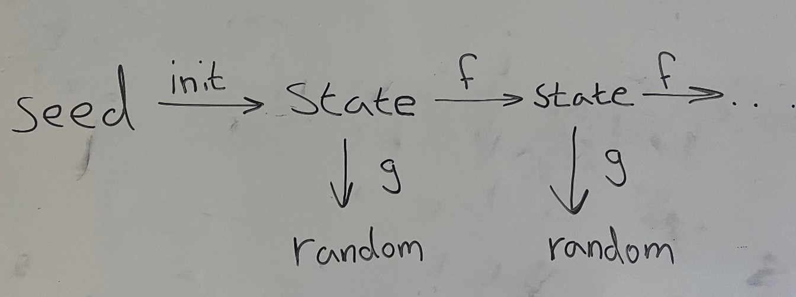

```{r include=FALSE}
library(mosaic)
```


# Introduction
I denne del af projektet, skabes en PRNG, med det formål, at simulere  og generere noget data, som først uniformfordeles. Dernæst bliver dataet så udsat for en box muller transformation så det bliver normalfordelt, og bedre kan analyseres statistisk interferentielt og deskriptivt.


# PRNG og TRNG
Indenfor tilfældige tal, findes der to termer. PRNG og TRNG, som står for "Pseudo Random Number Generator" og "True Random Number Generator". For at kunne generere tilfædlige tal ud fra deterministiske computere, har man brug for at bearbejde et input ved hjælp af en algoritme, og derved få et tilfældigt tal (også kaldet output) ud.

Den største forskel der er på pseudorandom tal og true random tal, er at de pseudorandom tal er blevet genereret til at ligne true random tal. De er altså ikke tilfældige, og deres output afhænger af et seed. Dette gør altså at resultaterne fra en PRNG kan reproduceres, hvis man sætter seed'et til en bestemt værdi. Dette gør PRNG'er godt egnet til simulationer. Man kan dele sine resultater fra en simulation med andre, hvis de også har sat seed'et, og dette gør det utroligt nemt at undersøge forskellige videnskabenlige fund. Siden at alt PRNG'er gør er at køre tal igennem en matematisk algoritme, betyder det, at de meget hurtigt og effektivt kan spytte tusinde af pseudotilfældige tal ud. 

Det er også muligt at generere true random tal. For eksempel, kan der ud fra atmosfærisk støj genereres true random tal. I modsætning til PRNG'er kan TRNG'er ikke lige så effektivt spytte tilfældige tal ud. Dette betyder altså at PRNG'er er meget bedre egnet til simulationer end TRNG'er er. TRNG'er er derimod bedre til ting som skal være tilfældige, såsom lotteriet eller gambling. De er også uden tvivl mere sikre indenfor krytografi end PRNG'er er. 

I dette projekt vil en PRNG implementeres i R, hvornæst de uniform fordelte tal skal transformeres v.h.a. Boxmuller. Dernæst vil R's indbyggede PRNG benyttes til at undersøge adskillige statistiske spørgsmål.

## Linear congruential generator
Målet ved en linear congruential generator er at genere et tilfældigt tal mellem 0 og 1. Linear congruential generator er en PRNG, så tallene der fås fra generatoren, vil ikke være fuldstændigt tilfældige. 
Der er 4 vigtige værdier indenfor en linear congruential generator.:
	X0, som svarer til denne generators seed; X0 ≥ 0.
	a, som bliver ganget på X0; a ≥ 0.
	c, som bliver adderet til X0; c ≥ 0.
	m, kaldet modulus; m > X0, m > a, m > c.
Disse værdier vil blive brugt i den nedenstående ligning.:
        X_(n+1)=(a*X_n+c)  mod m 
Her vil man starte med at indsætte X0 på Xn’s plads, og ud fra dette kan man finde X1. Derefter kan man indsætte X1 på Xn’s plads og derefter få X2. Denne proces kan gentages så mange gange som man har brug for.
Det er vigtigt at nævne, at før eller siden vil tallene fra sådanne en generator begynde at gentage sig selv. Ved at ændre m til et meget højt tal, vil der dog gå meget lang tid før at tallene begynder at gentage sig selv. Andre der bruger denne generator anbefaler 2^31. 
De tilfældige tal man kan få ud af denne generator, er uniform fordelt. Ved at omhyggeligt vælge sine a, c og m værdier kan man også sørge for at tallene man får, ikke ser ud til at have nogen korrelation med hinanden. Linear congruential generators er generelt også hurtige og kræver ikke særlig meget plads. En ulempe ved LCG er at dens state ikke er stor nok, se nedenstående billede.

{width=50%}

Når ens program startes op får man en state ud fra det seed man bruger. Denne state kan dernæst ændres til en anden state ved hjælp af en irreversibel funktion f. For at få et random tal ud, kan man bruge en irreversibel funktion g på staten. Dette kan dog kun gøres en gang per state, hvorimod andre PRNG’er kan have flere states på en gang. Et eksempel er Mersenne twister, som vil gennemgås forneden.

## Mersenne twister
Mersenne twisters mål er det samme som LCG. Dog er det en af de mere respekteret PRNG’er, da den er meget mindre forudsigelig. Når en mersenne twister bliver initialiseret, vil man få en state, som man ikke bruger til noget. Først efter at twiste state 0, med en irreversibel funktion, får man state 1, som ved hjælp af en anden reversibel funktion, kan lave op til 624 tilfældige tal. Dernæst kan man twiste staten igen, og få en ny state, som også kan lave op til 624 tilfældige tal. Dette gør at perioden af PRNG’en er meget længere, og dette er som sagt en stor fordel af PRNG’er. Da der bliver brugt en reversibel funktion fra state til de tilfældige tal, betyder det, at denne PRNG ikke kan bruges til kryptografi.

## Implementering af linear congruential generator
Efter at have undersøgt både mersenne twister og linear congruential generator, blev det besluttet at implementere LCG. For at gøre dette, blev der oprettet en funktion med en parameter i, som besluttede hvor mange tilfædlige tal man ville have ud. Hernæst blev x0 (seed'et) sat til 2000. Dernæst skulle der genereres et tilfældigt tal ud fra X_(n+1)=(a*X_n+c)%%m, hvilket betød at a, c og m skulle bestemmes. For at sørge for at få en PRNG med en lang periode, blev a sat til 11.102.357. C blev sat til 21.353 og m blev sat til 2^32. Der blev også lavet en variabel, t, som steg med en hver gang funktionen havde kørt rekursivt. Når t ikke længere var mindre end i, ville funktionen stoppe, og det ønskede antal tilfældige tal ville være genereret.

Sidst men ikke mindst, blev disse tal plottet i et histogram, for at sikre at outputtet var uniformt fordelt. Resultaterne af programmet kan ses forneden.

```{r Linear Congruence, echo=FALSE}

set.seed(1)
x0 = 2000

linear_congruence <- function(i) {
t <- 0
a <- 11102357
c <- 21353
m <- 2**32
v1 <- c()
while(t < i){
  x0 <- (a*x0+c)%%m
  v1 <- c(v1 , as.integer((x0/m)*100))
  t <- t + 1
  }
#print(v1)
gf_histogram(~v1, breaks = seq(0, 100, by=10), fill="black", col="grey", xlim = c(0, 100), ylab = "Antal", xlab = "Tilfældige tal inddelt i intervaller", title = "Resultaterne af den implementerede PRNG")

}
    
linear_congruence(i=100000)
```

## Boxmuller
Box-Muller transformationen er en metode, hvori to uniforme random variabler transformeres til et par uafhængige standard normal random variabler. Den primære ide er at ændre koordinatorne fra kartetiske til polære koordinator.
Sammenhænget mellem kartetiske og polære-koordinator er:
$x = cos(\theta)*r$
$y = sin(\theta)*r$
Ifølge boxmuller erstattes $\theta$ med $2\pi*U_2$ og $r$ erstattes med $\sqrt V$
hvor V er $-2*ln*U_1$
Her skal der altså bruges to værdier, $U_1$ og $U_2$. Disse værdier er de uniform random tal.
Det man får ud af dette, er to tal x og y, som i dette tilfælde er uafhængige random variabler med en normalfordeling. Forneden kan resultaterne af Box-Muller transformationen ses:

```{r echo=FALSE}

Box_muller_transform <- function(){
  n <- 10^4
  samples <- matrix(ncol = 2, nrow = n)
  uni_rand_num1 <- runif(10^4, 0, 1)
  uni_rand_num2 <- runif(10^4, 0, 1)
  R <- sqrt(-2*log(uni_rand_num1))
  theta <- 2*pi*uni_rand_num2
  X <- R*cos(theta)
  Y <- R*sin(theta)
  samples[,1] <- X
  samples[,2] <- Y 
  
  label <- rep(c("x", "y"),n)
  value <- c(samples[,1],samples[,2])
  df <- data.frame(value, label)
  library(ggplot2)
  plt <- ggplot(df, aes(x=value, color=label, fill=label)) + geom_histogram(aes(y=..density..), bins = 60, position= "identity", alpha =0.3) + labs(x="Value", y="Density") + theme_bw()
  print(plt)
}

Box_muller_transform()


```


